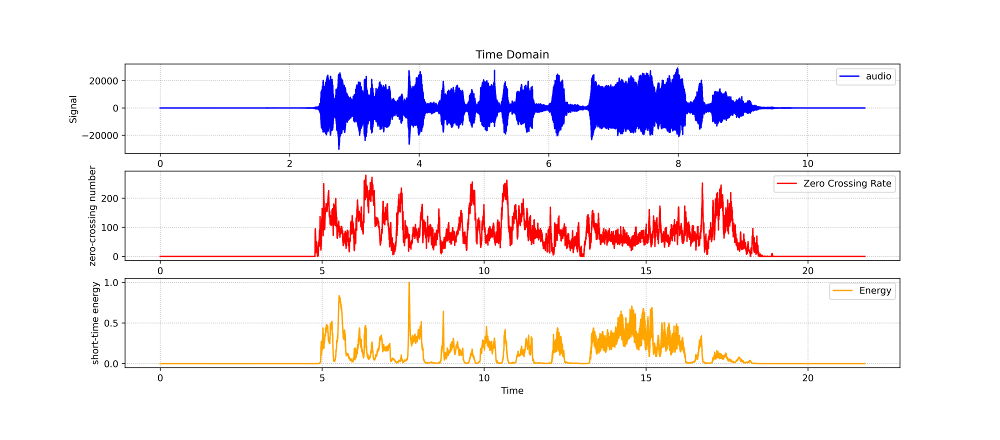
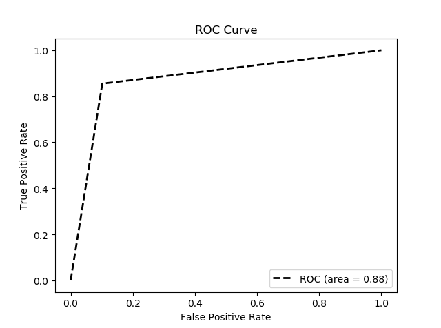

# Vocal-VAD in Music Scene

> The best is yet to come.

A project implementing vocal VAD (Voice Activity Detection) in music scene.

## Task

- Input: a complete music in `wav` format
- Output: vocal probability in per 10 ms

## Dataset

[MUSDB18](https://sigsep.github.io/datasets/musdb.html): contains 150 music tracks (*mixture*) along with their isolated *drums*, *bass*, *vocals* and *others* stems.

## Methods

### Feature Engineering

- STE: Short Time Energy, represents the energy of a frame of speech signal.
- ZCC: Zero Crossing Counter, represents the number of times the time domain signal of a frame passes through zero.

> In general, vocal fragments have high STE and low ZCC, while non-vocal fragments have low STE and high ZCC. 

The calculation methods of STE and ZCC is optimized in implementation.



### Vocal Extraction

[Spleeter](https://github.com/deezer/spleeter) is a U-Net based model to extract the vocal track from an audio, implemented in `tensorflow`. It provides pre-trained model and can be used straight from [command line](https://github.com/deezer/spleeter/wiki/2.-Getting-started#usage).

## Experiment

Reached an AUC of 0.88, a relatively high performance.



## Usage

- Install dependencies:
    ```
    > pip install -r requirements.txt
    ```

- `audio_segments.py`: to segment audio files in 10 ms

- `spleeter_process.py`: to automatically run spleeter to extract vocal tracks from original audios

- `data_process.py`: to process the extracted audio and output the VAD result

- `AUC.py`: to compare with ground truth to get ROC curve and AUC value
